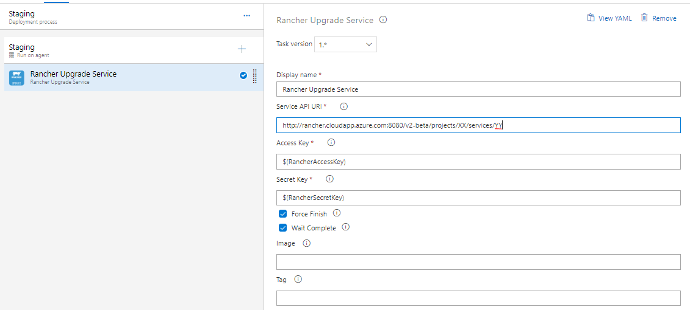

## Rancher Upgrader

Easy upgrade, rollback and finiish upgrade in your rancher cluster.

## Usage
Add a new task, select **Rancher Upgrader** from the **Deploy** category and configure it as needed.

Tasks: 

- `Rancher Upgrader Service`
- `Rancher Rollback Last Upgrade`
- `Rancher Finish Last Upgrade`

Parameters include:

- **Service API Url**: Ranchel API URL to service. e.g. http://rancher.mycompany.com:8080/v2-beta/projects/{projectId}}/services/{serviceId}
- **Access Key**: Access Key generated in Rancher ('API' > 'Keys')
- **Secret Key**: Secret Key generated in Rancher ('API' > 'Keys')
- **Force Finish**: Force finish before upgrade, if last upgrade is pending
- **Wait Complete**: Wait upgrade and new services up
- **Image**: Image slug name or full address. e.g. docker.azurecr.io/xxx/my-image
- **Tag**: 

## Release notes

**New in 1.0.8**
- First version with basic commands;
- Upgrade service;
- Rollback last upgrade;
- Finish last upgrade;
- Change image or tag;
- Force finish before upgrade;
- Wait results to continue tasks (success) or abort (fails);

## Did you like it? Please, make a donate :)

if you liked this project, please make a contribution and help to keep this and other initiatives, send me some Satochis.

BTC Wallet: `1G535x1rYdMo9CNdTGK3eG6XJddBHdaqfX`

